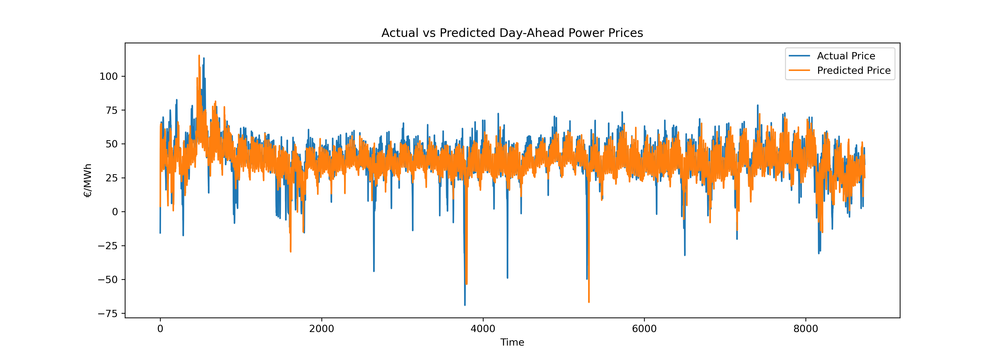

# European Power Fair Value Forecast
## End-to-end energy trading forecasting pipeline with AI-assisted market interpretation.
**Candidate:** Nidhim Soni
**Case Study:** Cobblestone Energy – Trading & AI Assessment

---

## Project Objective

Build an end-to-end pipeline to estimate **fair value** for the German Day-Ahead electricity market and translate forecasts into **tradable prompt power signals**.

The project replicates a real quantitative energy trading workflow:

**Data → Forecast → Fair Value → Trading Decision → AI Commentary**

---

## Key Results

* Market: Germany (DE-LU Day-Ahead Power)
* Forecast Horizon: Next-Day Hourly Prices
* Baseline MAE: **21.37 €/MWh**
* XGBoost MAE: **6.54 €/MWh**
* Improvement: **~70% error reduction**

Forecast deviations are converted into LONG/SHORT trading positions.

---
## Forecast Performance


## Data Sources

* European Wholesale Electricity Prices (Hourly)
* Open Power System Data – Weather Dataset (Temperature fundamentals)

---

## Pipeline Overview

1. Data ingestion & cleaning
2. QA validation checks
3. Feature engineering

   * calendar effects
   * lagged prices
   * temperature fundamentals
4. Baseline persistence model
5. Machine learning model (XGBoost)
6. Time-series validation
7. Fair value estimation
8. Trading signal generation
9. Automated AI trader commentary

---

## Trading Interpretation

Fair value signal:

```
Fair Value = Predicted Price − Market Price
```

| Signal   | Trading View |
| -------- | ------------ |
| Positive | LONG Power   |
| Negative | SHORT Power  |
| Small    | HOLD         |

This mimics prompt-curve positioning used by power traders.

---

## AI Component

An automated AI trading assistant generates daily market commentary based on model signals, reducing manual analyst interpretation.

Output:

```
outputs/ai_trader_commentary.txt
```

---

## Repository Structure

```
src/        → pipeline scripts  
data/       → processed datasets  
outputs/    → forecasts & trading signals  
notebooks/  → visualization notebook  
```

---

## Run Full Pipeline

```
python src/load_prices.py
python src/qa_check.py
python src/merge_weather.py
python src/feature_engineering.py
python src/train_baseline.py
python src/train_xgboost.py
python src/trading_signal.py
python src/llm_commentary.py
```

---

## Reproducibility

Install dependencies:

```
pip install -r requirements.txt
```

---

## Result

The pipeline produces a daily **fair-value trading signal** and automated AI market interpretation suitable for energy trading workflows.
